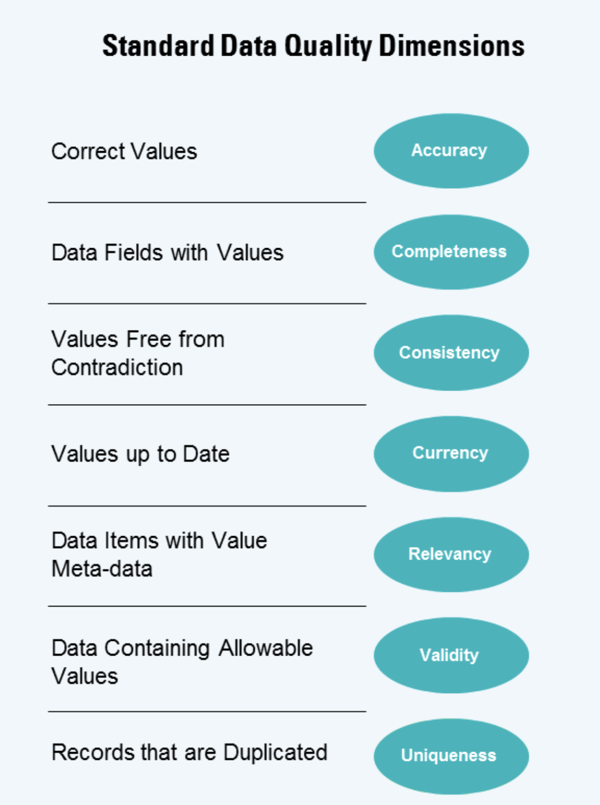

# KPMG Virtual Internship

Inside Sherpa has a virtual internship at [KPMG](https://www.insidesherpa.com/virtual-internships/theme/m7W4GMqeT3bh9Nb2c/KPMG-Data-Analytics-Virtual-Internship) that is free of cost. This internship can be done within in a day and provides good insight into the responsibilities of a data scientist. The internship is split into 3 sections with each section providing a model answer for students to compare and reflect on.

## Sections

1. Students are introduced to the client and asked to evaluate datasets' quality using data quality dimensions (see below). Students must then communicate their findings in an email to the client and discuss the potential impacts of the data on further investigation and analysis.

2. Suggest the 1000 individuals that the client should target in order to drive the most value. Then, submit a Powerpoint that illustrates the 3 steps of data exploration, modeling, and interpretation.

3. Present the data analysis to the client using a dashboard

## Table of Contents

Module_1 - All files and task for module 1 in more detail

Module_2 - All files and task for module 2 in more detail

Module_3 - All files and task for module 3 in more detail

Model_Answers- Contain the model examples for comparison and reflection
